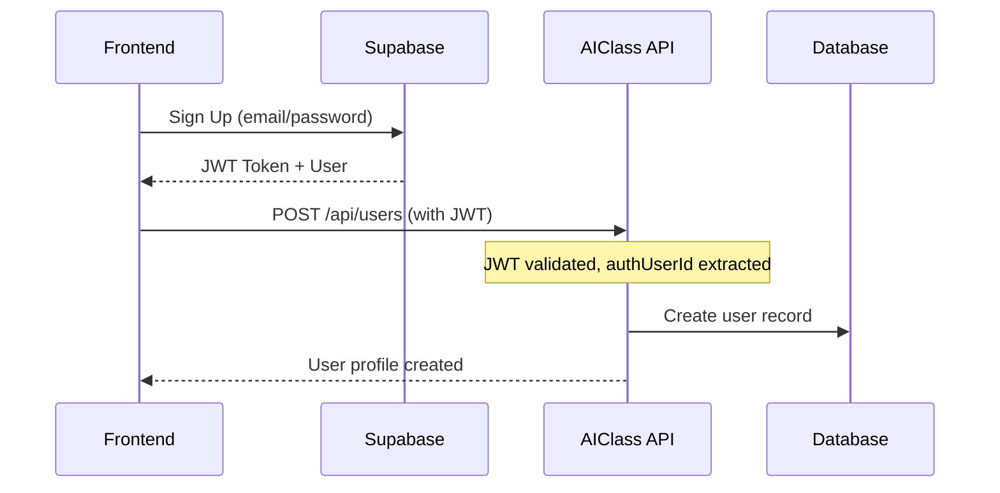
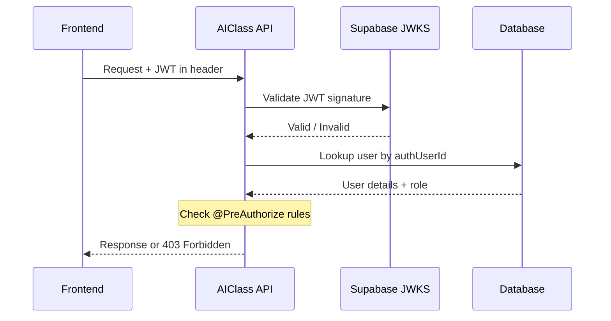

# 🔐 Authentication & Authorization Guide

Complete guide for implementing JWT-based authentication with Supabase Auth in AIClass API.

## Table of Contents
- [Overview](#overview)
- [Architecture](#architecture)
- [Setup Instructions](#setup-instructions)
- [Authentication Flow](#authentication-flow)
- [Authorization Rules](#authorization-rules)
- [Testing Authentication](#testing-authentication)
- [Troubleshooting](#troubleshooting)

---

## Overview

The AIClass API uses **JWT-based authentication** powered by **Supabase Auth**. The system implements:

- ✅ **JWT Token Validation**: Validates tokens using Supabase's JWK Set
- ✅ **Role-Based Access Control (RBAC)**: TEACHER and STUDENT roles
- ✅ **Row Level Security (RLS)**: Database-level security policies
- ✅ **Stateless Sessions**: No server-side session storage
- ✅ **CORS Support**: Configured for frontend integration

## Architecture

```
┌─────────────┐         ┌──────────────┐         ┌─────────────┐
│   Frontend  │         │  Supabase    │         │  AIClass    │
│   (React/   │────1───>│    Auth      │────2───>│     API     │
│   Angular)  │         │   (Issues    │         │  (Spring    │
│             │         │     JWT)     │         │    Boot)    │
└─────────────┘         └──────────────┘         └─────────────┘
                              │                          │
                              │                          │
                              └─────────3────────────────┘
                                   Validates JWT
                                   
Flow:
1. User logs in via frontend → Supabase Auth
2. Supabase issues JWT token with user claims
3. Frontend sends JWT in Authorization header
4. Spring Boot validates JWT and extracts user info
5. API enforces role-based access control
```

### Key Components

| Component | Purpose |
|-----------|---------|
| **SecurityConfig** | Main security configuration, JWT validation setup |
| **SupabaseJwtAuthenticationConverter** | Converts JWT claims to AuthenticatedUser |
| **AuthenticatedUser** | Custom UserDetails with role information |
| **SecurityContextHelper** | Utility to access current user in services |
| **@PreAuthorize** | Method-level authorization annotations |
| **RLS Policies** | Database-level row filtering |

---

## Setup Instructions

### Step 1: Configure Supabase Project

1. **Enable Supabase Auth**:
   - Go to your Supabase project dashboard
   - Navigate to **Authentication** > **Providers**
   - Enable desired auth providers (Email, Google, GitHub, etc.)

2. **Get API Credentials**:
   - Go to **Project Settings** > **API**
   - Copy:
     - Project URL: `https://your-project.supabase.co`
     - Project Reference: `your-project-ref`
     - anon/public key
     - service_role key (keep secure!)

3. **Run Database Migration**:
   ```bash
   # Apply RLS policies and auth integration
   psql $DB_URL -f supabase/migrations/20250111000000_comprehensive_auth_and_rls.sql
   ```

### Step 2: Configure Spring Boot Application

1. **Update `application-local.properties`**:
   ```properties
   # Supabase Configuration
   supabase.jwt.jwk-set-uri=https://your-project-ref.supabase.co/auth/v1/jwks
   supabase.url=https://your-project-ref.supabase.co
   supabase.anon.key=your-anon-public-key
   supabase.service.role.key=your-service-role-key
   
   # CORS - Add your frontend URLs
   security.cors.allowed-origins=http://localhost:3000,http://localhost:5173
   
   # Optional: Enable security debugging
   logging.level.org.springframework.security=DEBUG
   ```

2. **Set Environment Variables** (Production):
   ```bash
   export SUPABASE_JWT_JWK_SET_URI="https://your-project.supabase.co/auth/v1/jwks"
   export SUPABASE_URL="https://your-project.supabase.co"
   export SUPABASE_ANON_KEY="your-anon-key"
   export SUPABASE_SERVICE_ROLE_KEY="your-service-role-key"
   export ALLOWED_ORIGINS="https://yourdomain.com"
   ```

### Step 3: Test the Setup

1. **Start the application**:
   ```bash
   ./mvnw spring-boot:run
   ```

2. **Verify endpoints are protected**:
   ```bash
   # This should return 401 Unauthorized
   curl http://localhost:8080/api/users
   ```

3. **Test with valid JWT**:
   ```bash
   # Get JWT from Supabase (via frontend login)
   curl http://localhost:8080/api/users \
     -H "Authorization: Bearer YOUR_JWT_TOKEN"
   ```

---

## Authentication Flow

### 1. User Registration Flow



**Example Request**:
```bash
POST /api/users
Authorization: Bearer <supabase_jwt_token>
Content-Type: application/json

{
  "authUserId": "550e8400-e29b-41d4-a716-446655440000",
  "fullName": "Jane Doe",
  "email": "jane.doe@university.edu",
  "role": "STUDENT",
  "metadata": {}
}
```

### 2. Authenticated Request Flow



---

## Authorization Rules

### Role-Based Access Control

The API enforces the following authorization rules:

#### 👤 **User Management** (`/api/users`)

| Endpoint | Method | Access |
|----------|--------|--------|
| Create User | `POST /api/users` | Authenticated (for self-registration) |
| Update User | `PUT /api/users/{id}` | Authenticated (own profile) |
| Get User by ID | `GET /api/users/{id}` | TEACHER only |
| Get All Users | `GET /api/users` | TEACHER only |
| Delete User | `DELETE /api/users/{id}` | Authenticated (own profile) |

#### 🏫 **Class Management** (`/api/classes`)

| Endpoint | Method | Access |
|----------|--------|--------|
| Create Class | `POST /api/classes` | TEACHER only |
| Update Class | `PUT /api/classes/{id}` | TEACHER only |
| Get Class | `GET /api/classes/{id}` | Authenticated (with RLS) |
| List Classes | `GET /api/classes` | Authenticated (with RLS) |
| Delete Class | `DELETE /api/classes/{id}` | TEACHER only |

**RLS Policy**: Students can only view classes they're enrolled in.

#### 📝 **Grade Management** (`/api/grades`)

| Endpoint | Method | Access |
|----------|--------|--------|
| Create Grade | `POST /api/grades` | TEACHER only |
| Update Grade | `PUT /api/grades/{id}` | TEACHER only |
| Get Grades | `GET /api/grades` | Authenticated (with RLS) |
| Delete Grade | `DELETE /api/grades/{id}` | TEACHER only |

**RLS Policy**: Students can only view their own grades.

#### 👨‍🎓 **Enrollment Management** (`/api/enrollments`)

| Endpoint | Method | Access |
|----------|--------|--------|
| Enroll Student | `POST /api/enrollments` | TEACHER only |
| Update Enrollment | `PATCH /api/enrollments/{id}` | TEACHER only |
| Get Enrollments | `GET /api/enrollments` | Authenticated (with RLS) |
| Delete Enrollment | `DELETE /api/enrollments/{id}` | TEACHER only |

#### 📚 **Subject Management** (`/api/subjects`)

| Endpoint | Method | Access |
|----------|--------|--------|
| Create Subject | `POST /api/subjects` | TEACHER only |
| Update Subject | `PUT /api/subjects/{id}` | TEACHER only |
| Get Subjects | `GET /api/subjects` | Authenticated |
| Delete Subject | `DELETE /api/subjects/{id}` | TEACHER only |

#### 🤖 **AI Recommendations** (`/api/recommendations`)

| Endpoint | Method | Access |
|----------|--------|--------|
| Create Recommendation | `POST /api/recommendations` | Authenticated |
| Get Recommendations | `GET /api/recommendations` | Authenticated (with RLS) |
| Delete Recommendation | `DELETE /api/recommendations/{id}` | Authenticated (own only) |

**RLS Policy**: Users can only view recommendations addressed to them.

### Row Level Security (RLS)

Database-level policies ensure data isolation:

```sql
-- Example: Students can only view their own grades
CREATE POLICY "grades_student_view_own" ON public.grades
  FOR SELECT
  TO authenticated
  USING (
    student_user_id = public.get_current_user_id()
  );
```

RLS is enabled on all tables:
- ✅ `users`
- ✅ `classes`
- ✅ `enrollments`
- ✅ `grades`
- ✅ `subjects`
- ✅ `ai_recommendations`

---

## Testing Authentication

### Using Postman

1. **Set up environment variables**:
   ```json
   {
     "baseUrl": "http://localhost:8080",
     "jwtToken": "your-supabase-jwt-token"
   }
   ```

2. **Configure Authorization**:
   - Type: Bearer Token
   - Token: `{{jwtToken}}`

3. **Test protected endpoint**:
   ```
   GET {{baseUrl}}/api/users
   Authorization: Bearer {{jwtToken}}
   ```

### Using cURL

```bash
# Set your JWT token
JWT_TOKEN="your-supabase-jwt-token"

# Test authenticated endpoint
curl -X GET http://localhost:8080/api/users \
  -H "Authorization: Bearer $JWT_TOKEN" \
  -H "Content-Type: application/json"

# Test role-based access (TEACHER only)
curl -X POST http://localhost:8080/api/classes \
  -H "Authorization: Bearer $JWT_TOKEN" \
  -H "Content-Type: application/json" \
  -d '{
    "subjectId": "...",
    "teacherUserId": "...",
    "year": 2025,
    "semester": "SPRING",
    "groupCode": "A1"
  }'
```

### Integration Testing

```java
@SpringBootTest
@AutoConfigureMockMvc
class AuthenticationIntegrationTest {
    
    @Autowired
    private MockMvc mockMvc;
    
    @Test
    void shouldReturn401WhenNoToken() throws Exception {
        mockMvc.perform(get("/api/users"))
            .andExpect(status().isUnauthorized());
    }
    
    @Test
    @WithMockUser(roles = "TEACHER")
    void shouldAllowTeacherToAccessUsers() throws Exception {
        mockMvc.perform(get("/api/users"))
            .andExpect(status().isOk());
    }
}
```

---

## Troubleshooting

### Common Issues

#### 1. **401 Unauthorized - Token Invalid**

**Symptoms**: All requests return 401, even with token

**Solutions**:
- ✅ Verify JWT is valid (not expired)
- ✅ Check `supabase.jwt.jwk-set-uri` is correct
- ✅ Ensure token is in `Authorization: Bearer <token>` format
- ✅ Check Supabase project URL matches configuration

```bash
# Decode JWT to check expiration
echo "YOUR_JWT" | cut -d. -f2 | base64 -d | jq
```

#### 2. **403 Forbidden - Insufficient Permissions**

**Symptoms**: Token validates but request is denied

**Solutions**:
- ✅ Check user role in database matches endpoint requirements
- ✅ Verify `@PreAuthorize` annotations are correct
- ✅ Ensure user record exists in `users` table with correct role

```sql
-- Check user's role
SELECT id, email, role FROM users WHERE auth_user_id = 'your-auth-uuid';
```

#### 3. **RLS Policy Blocks Query**

**Symptoms**: Query returns empty results despite data existing

**Solutions**:
- ✅ Check RLS policies allow the query
- ✅ Verify `auth_user_id` matches between Supabase and database
- ✅ Use service role key for admin operations (bypass RLS)

```sql
-- Test RLS policy (as superuser)
SELECT * FROM grades WHERE student_user_id = 'some-uuid';

-- Check current RLS policies
SELECT * FROM pg_policies WHERE tablename = 'grades';
```

#### 4. **CORS Errors**

**Symptoms**: Browser blocks requests, CORS error in console

**Solutions**:
- ✅ Add frontend URL to `security.cors.allowed-origins`
- ✅ Ensure credentials are allowed (already configured)
- ✅ Check preflight (OPTIONS) requests succeed

```properties
# Add multiple origins
security.cors.allowed-origins=http://localhost:3000,https://yourdomain.com
```

### Debugging Tips

1. **Enable Security Logging**:
   ```properties
   logging.level.org.springframework.security=DEBUG
   logging.level.com.viveek.aiclass.security=DEBUG
   ```

2. **Check JWT Claims**:
   ```java
   // In your service layer
   AuthenticatedUser user = SecurityContextHelper.getCurrentUser()
       .orElseThrow(() -> new UnauthorizedException("Not authenticated"));
   log.info("Current user: {} (role: {})", user.getEmail(), user.getRole());
   ```

3. **Test RLS Policies**:
   ```sql
   -- Set session to specific user
   SET LOCAL request.jwt.claims TO '{"sub": "user-uuid"}';
   
   -- Test query
   SELECT * FROM grades;
   ```

---

## Best Practices

### Security Best Practices

1. **Never commit secrets**:
   - ✅ Use environment variables for production
   - ✅ Add `application-local.properties` to `.gitignore`
   - ✅ Use secrets managers (AWS Secrets Manager, Vault)

2. **Token Management**:
   - ✅ Set appropriate JWT expiration (default: 1 hour)
   - ✅ Implement token refresh on frontend
   - ✅ Revoke tokens on logout (via Supabase)

3. **RLS Policies**:
   - ✅ Always enable RLS on all tables
   - ✅ Test policies thoroughly before production
   - ✅ Use service role key sparingly (admin operations only)

4. **HTTPS Only**:
   - ✅ Always use HTTPS in production
   - ✅ Set secure cookie flags
   - ✅ Enable HSTS headers

### Development Best Practices

1. **Use SecurityContextHelper**:
   ```java
   // ✅ Good
   UUID currentUserId = SecurityContextHelper.getCurrentUserId()
       .orElseThrow(() -> new UnauthorizedException());
   
   // ❌ Avoid
   SecurityContextHolder.getContext().getAuthentication()...
   ```

2. **Validate Authorization in Services**:
   ```java
   public void deleteGrade(UUID gradeId) {
       // Check ownership before deletion
       Grade grade = gradeRepository.findById(gradeId)...;
       
       if (!SecurityContextHelper.isTeacher()) {
           throw new ForbiddenException("Only teachers can delete grades");
       }
   }
   ```

3. **Test with Different Roles**:
   ```java
   @Test
   @WithMockUser(roles = "STUDENT")
   void studentShouldNotAccessAllGrades() {
       assertThrows(AccessDeniedException.class, 
           () -> gradeService.getAllGrades());
   }
   ```

---

## Additional Resources

- [Supabase Auth Documentation](https://supabase.com/docs/guides/auth)
- [Spring Security OAuth2 Resource Server](https://docs.spring.io/spring-security/reference/servlet/oauth2/resource-server/index.html)
- [JWT.io - Token Debugger](https://jwt.io/)
- [PostgreSQL RLS Documentation](https://www.postgresql.org/docs/current/ddl-rowsecurity.html)

---

## Support

For issues or questions:
1. Check this guide first
2. Review application logs
3. Check Supabase Auth logs in dashboard
4. Open an issue on GitHub with:
   - Error message
   - Relevant logs
   - Steps to reproduce

